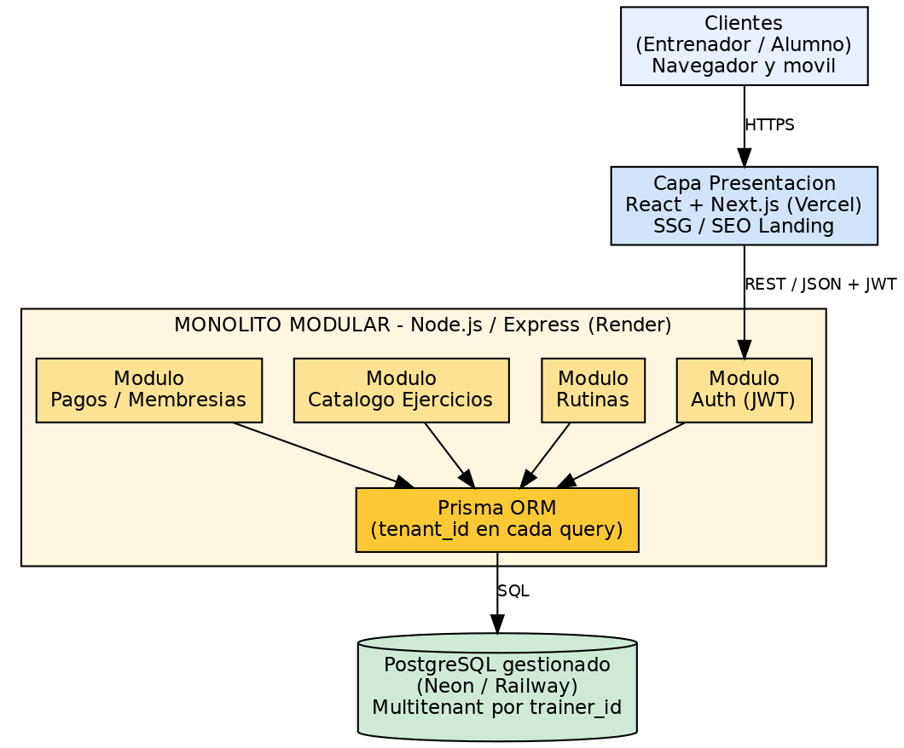

# TrainerOS — API (Monolito Modular · MVP)

Plataforma **SaaS B2B2C** de gestión para entrenadores personales independientes.
Este repositorio contiene el **backend** del MVP: una API REST construida como
**monolito modular en 3 capas** (Fase 1 del Trabajo Final Integrador).

> Trabajo Final Integrador — _Desarrollo de Aplicaciones Web_ · MMP-SOFTWARE · 2026
> Equipo de 8 integrantes.

---

## Problema y modelo de negocio

Hoy los entrenadores gestionan decenas de alumnos con planillas de Excel y mensajes
de WhatsApp: caos logístico, rutinas desactualizadas y pérdida de control sobre los
cobros de membresías.

**TrainerOS** lo resuelve con un modelo de **suscripción mensual por entrenador**
(SaaS multitenant). El entrenador paga la herramienta; sus alumnos acceden gratis a
un panel móvil donde consumen la rutina del día y marcan su progreso.

Alcance del MVP: autenticación con Google, constructor de rutinas sobre un catálogo
de ejercicios, panel móvil del alumno y control de pagos de membresías con alertas
de vencimiento.

## Arquitectura (Fase 1)

Monolito modular en 3 capas:

- **Presentación:** React + Next.js (SSG para la landing/SEO) → Vercel _(repo aparte)_.
- **Aplicación:** API REST **Node.js + Express + TypeScript**, organizada en módulos
  con límites claros (Auth, Rutinas, Catálogo, Pagos). Valida JWT y aplica las reglas
  de negocio. **Prisma ORM** como capa de abstracción de datos → Render/Railway.
- **Datos:** **PostgreSQL** gestionado (Neon/Railway). Aislamiento multitenant: toda
  consulta inyecta el `trainer_id` validado desde el JWT.



> **¿Por qué un monolito modular para arrancar?** Minimiza costo y time-to-market
> (un solo despliegue, una sola base, un solo pipeline; ~USD 7–16/mes). La modularidad
> interna no es accidental: cada módulo está pensado como **futuro candidato a
> microservicio** (Fase 2), reduciendo el costo de la migración.

## Estructura

```
traineros/
├─ prisma/
│  └─ schema.prisma        # Esquema base (datasource + generator)
├─ src/
│  ├─ config/env.ts        # Validación de variables de entorno (Zod)
│  ├─ middlewares/         # Middlewares transversales (ej. auth JWT)
│  ├─ modules/             # Módulos de negocio (límites de futuros microservicios)
│  │  ├─ auth/  rutinas/  catalogo/  pagos/
│  ├─ routes/              # Routers transversales (ej. healthcheck)
│  ├─ app.ts               # Construcción de la app Express
│  └─ server.ts            # Punto de entrada
├─ eslint.config.js
├─ tsconfig.json
└─ package.json
```

## Puesta en marcha

```bash
npm install
cp .env.example .env        # completar DATABASE_URL y JWT_SECRET
npm run dev                 # servidor en modo watch (tsx)
```

Healthcheck: `GET http://localhost:3000/health`

| Script              | Descripción                          |
| ------------------- | ------------------------------------ |
| `npm run dev`       | Servidor en modo desarrollo (watch). |
| `npm run build`     | Compila TypeScript a `dist/`.        |
| `npm start`         | Ejecuta el build.                    |
| `npm run typecheck` | Chequeo de tipos sin emitir.         |
| `npm run lint`      | ESLint sobre `src/`.                 |
| `npm run format`    | Prettier sobre el repo.              |

## Estrategia de ramas

GitHub Flow extendido. Ver **[CONTRIBUTING.md](CONTRIBUTING.md)**.

- `main` → producción (protegida, solo vía PR aprobado).
- `dev` → integración.
- `feat/*`, `fix/*`, `chore/*` → ramas temporales por tarea.

## Equipo

MMP-SOFTWARE — 8 integrantes. Toda contribución entra por **Pull Request** a `dev`.
